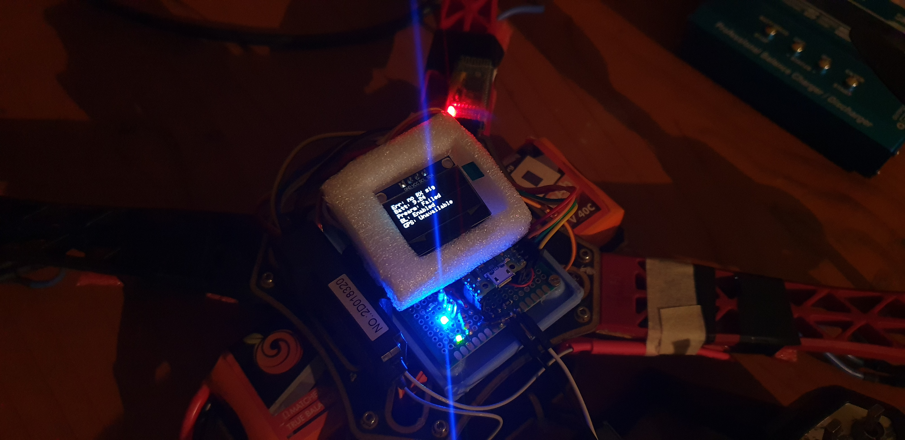
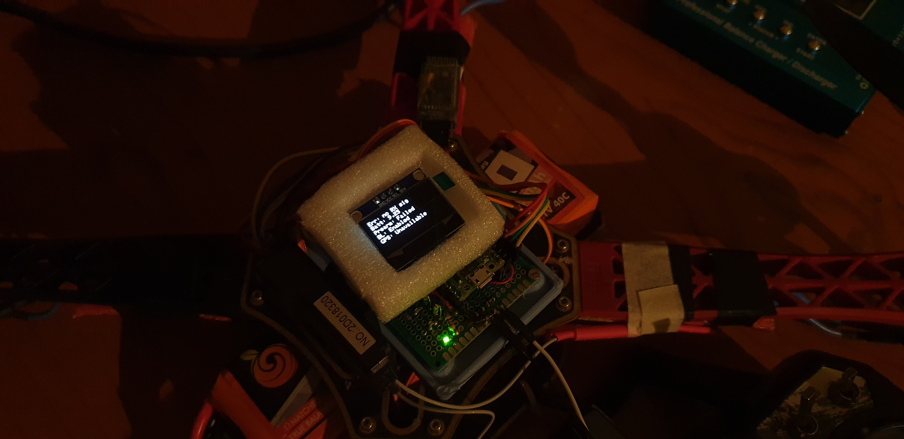
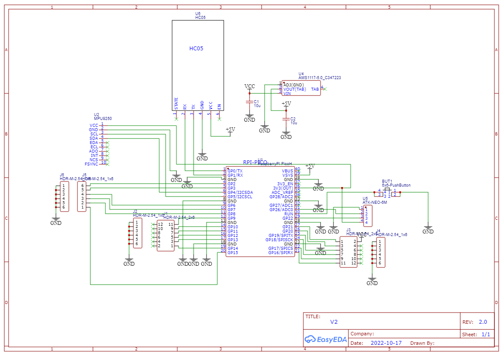
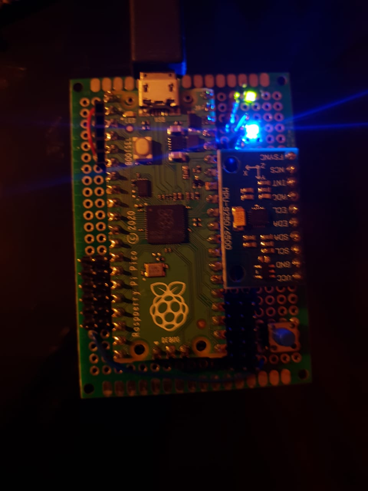
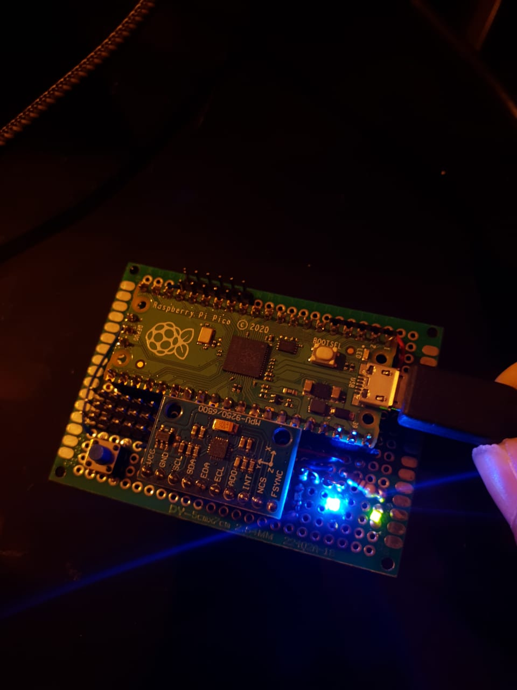

# Pico FC !
## A flight controller based on raspberry pico.
### ⚠️ Under development ⚠️

## Latest: fcV2

##💥 Updates 💥: 





## Connections:

### *RPI PICO -> COMPONENTS*

Indicators:
```
  GPIO 2 -> GREEN LED
  GPIO 3 -> BLUE LED
  GPIO 6 -> RED
```

MPU9250:
```
  GPIO 4 -> SDA
  GPIO 5 -> SCL
  VCC -> 3V3
  GND -> GND
```

RECEIVER INPUTS(NOT DECIDED):
```
  GPIO 9 -> ~
  GPIO 10 -> ~
  GPIO 11 -> ~
  GPIO 12 -> ~
  GPIO 13 -> ~
  GPIO 14 -> ~
```

ESC OUTS(current):
```
  GPIO 18 -> MOTOR 1
  GPIO 19 -> MOTOR 2
  GPIO 17 -> MOTOR 3
  GPIO 16 -> MOTOR 4
```

GPS (TO BE ADDED):
```
  3V3 -> VCC
  GND -> GND
  GPIO 22 -> RX
  GPIO 26 -> TX
```

HC05 (TO BE ADDED):
```
  3V3 -> VCC
  GND -> GND
  GPIO 0 -> RX
  GPIO 1 -> TX
```

## Schematics:


## Extras:



